# More Secure App, now Dockerized! 
Dockerized web application demonstrating authentication and authorization with JWTs built with Node.js, Express, PostgreSQL, and React.

To run application, run `docker-compose up -d` from the root folder. This website will be accessible from localhost:1234

When initialized, two users will be created:
- Admin Account
  * Username: admin
  * Password: administrator
  * Roles: Admin/Moderator/User
- Moderator Account
  * Username: mod
  * Password: moderator
  * Roles: Moderator/User
  
All new users will only have the User role provisioned.

### To-do: 
- Implement error handling for registration page - username/email in use
- Create .env file for use with api/database/docker-compose

# Screenshots
## Pages
### Home
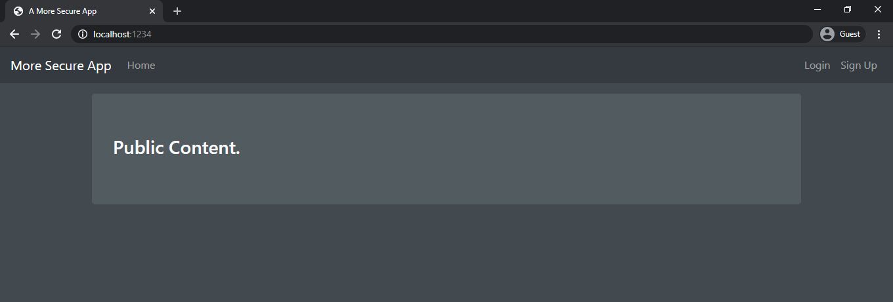
### Login
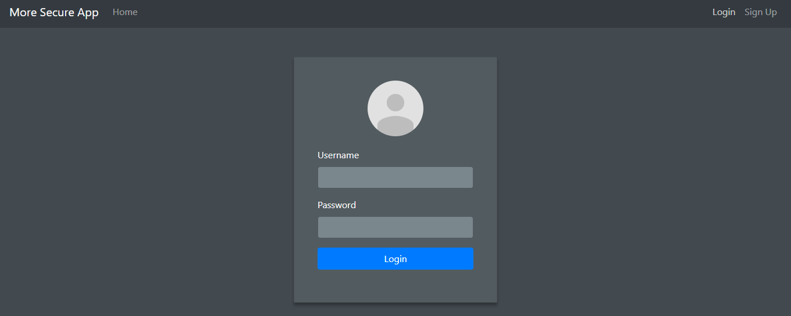
### Signup
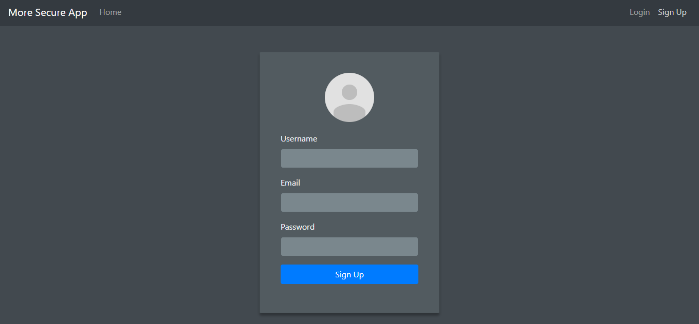
### User Registered
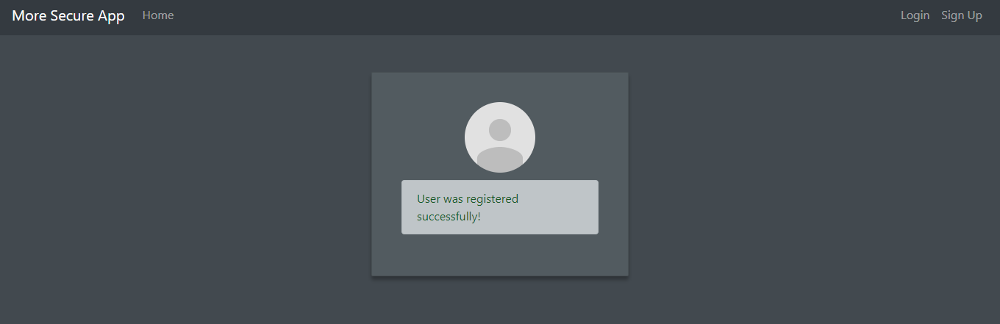
### Registered Users
#### User Board
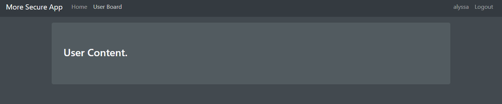
#### Moderator Board
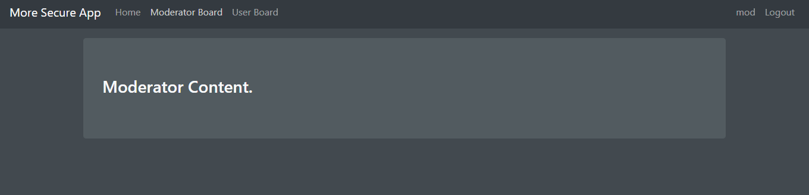
#### Admin Board with Ping Test
##### Host Reachable
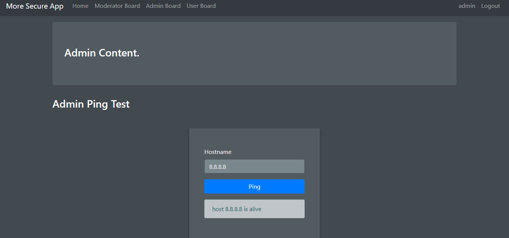
##### Host Unreachable
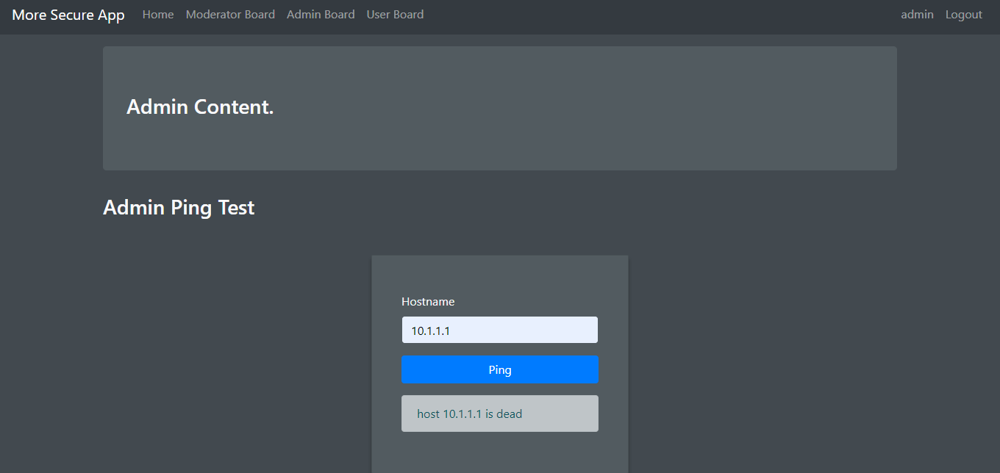
## Error Handling
### Unauthorized View
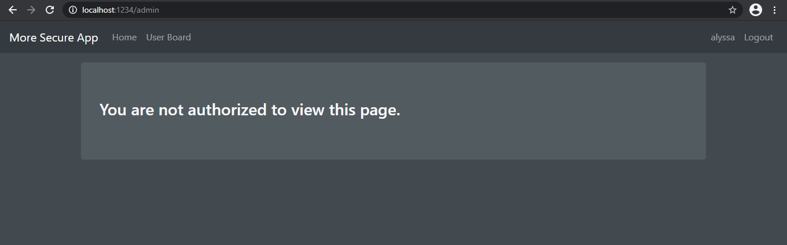
### Invalid Hostname for Ping Test
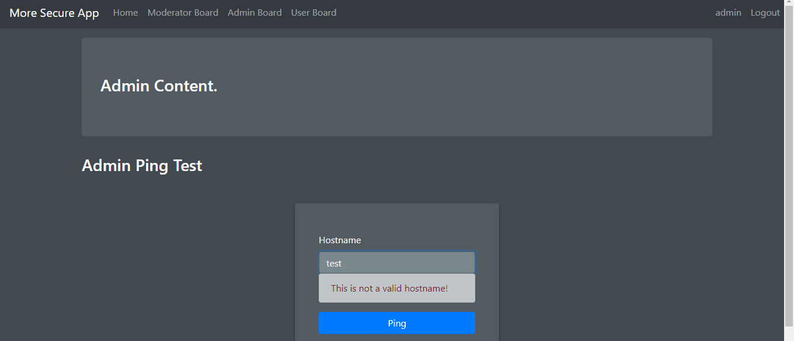
### Login Errors
#### Incorrect Credentials
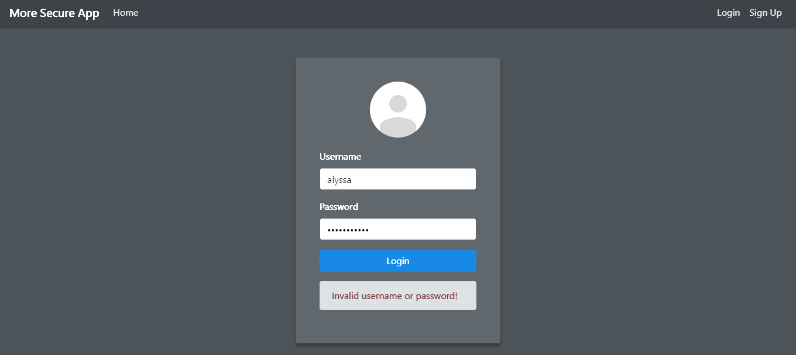
#### Required Field
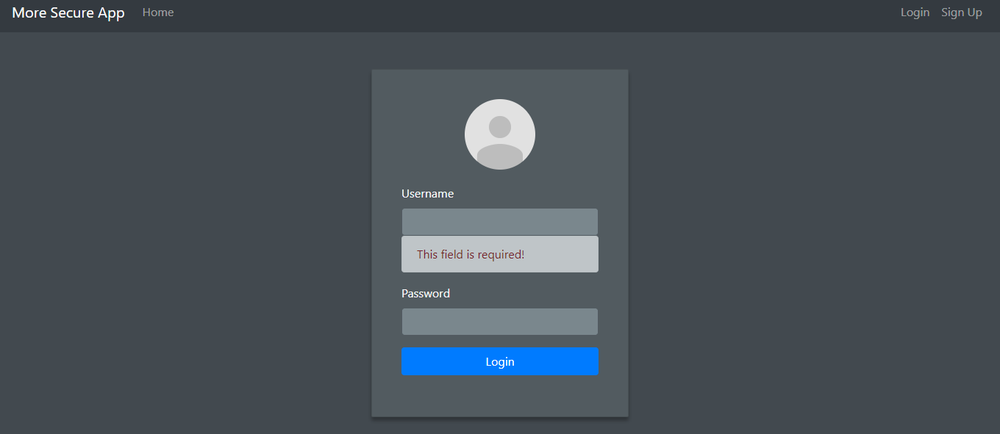
### Registration Errors
#### Invalid Email
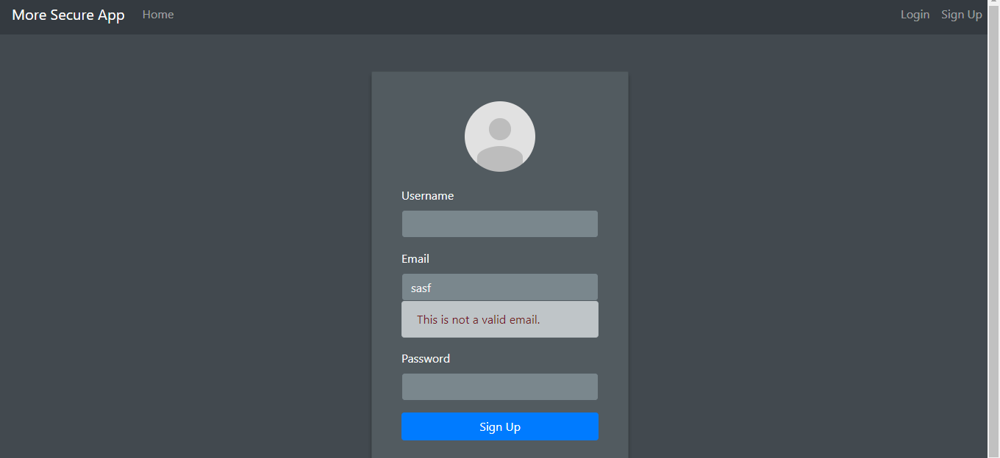
#### Invalid Password
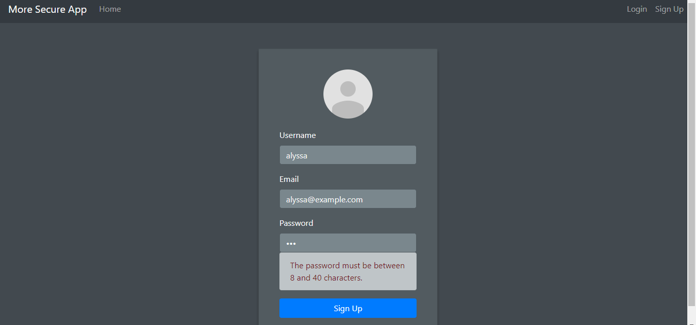
